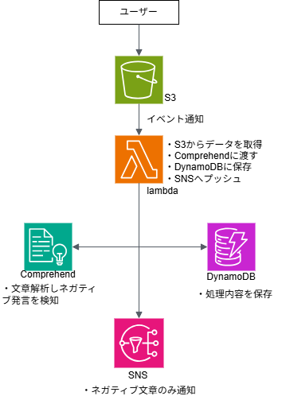

## システム概要
S3にアップロードされたテキストをAmazon Comprehendで感情分析し、ネガティブ判定時にはSNSでメール通知を行うシステム。分析結果はDynamoDBに保存。

## 使用サービス
- Amazon S3
- AWS Lambda
- Amazon Comprehends
- Amazon DynamoDB
- Amazon SNS
- Amazon CloudWatch
- AWS IAM

## 構成図

## システム処理フロー
1.ユーザーがS3へテキストファイルをアップロード
2.S3イベント通知によりLambdaが起動
3.LambdaがS3からファイル内容を取得
4.Amazon Comprehendで感情分析を実施
5.分析結果をDynamoDBへ保存
6.negative判定時の場合、SNSでメール通知を送信

## スクリーンショット
- S3バケットを作成しました

- Lambdaを作成しました。コードは別ファイルに記載しています。

