# システム概要
S3にアップロードされたテキストをAmazon Comprehendで感情分析し、ネガティブ判定時にはSNSでメール通知を行うシステム。分析結果はDynamoDBに保存。

# 作成理由
普段Udemyを用いてAWS資格の学習を行っている中で、
レビュー欄にネガティブなコメントが投稿されるケースが多く見られました。
それらのネガティブレビューに対して出品者が個別に対応している様子を確認し、
対応が必要なコメントかどうかを判断するシステムを作成したいと考えました。

# 使用サービス
- Amazon S3
- AWS Lambda
- Amazon Comprehends
- Amazon DynamoDB
- Amazon SNS
- Amazon CloudWatch
- AWS IAM

# 構成図

# システム処理フロー
1.ユーザーがS3へテキストファイルをアップロード
2.S3イベント通知によりLambdaが起動
3.LambdaがS3からファイル内容を取得
4.Amazon Comprehendで感情分析を実施
5.分析結果をDynamoDBへ保存
6.negative判定時の場合、SNSでメール通知を送信

# 障害時の運用
本システムではCloudWatch Logsに処理結果を出力しており、
エラー発生時はログを確認することで原因調査が可能です。

# スクリーンショット
## S3バケットを作成しました
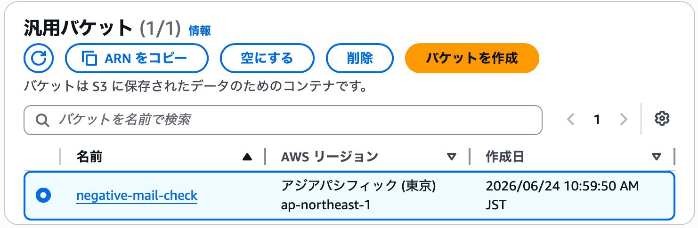

## Lambdaを作成しました。
S3イベント通知を受け取り、自動で感情分析を実行するLambdaを作成しました。コードは別ファイルに記載しています。
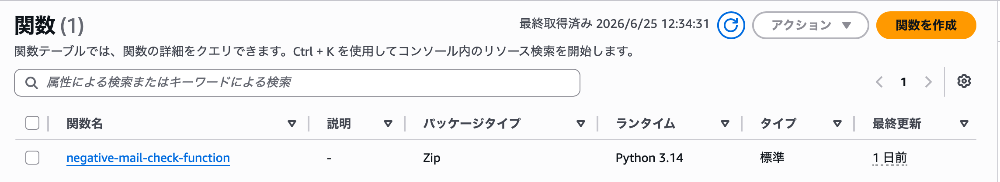

## Lambdaダイアグラムを確認しました。
S3からLambdaへイベント通知が行われる構成になっていることを確認しました
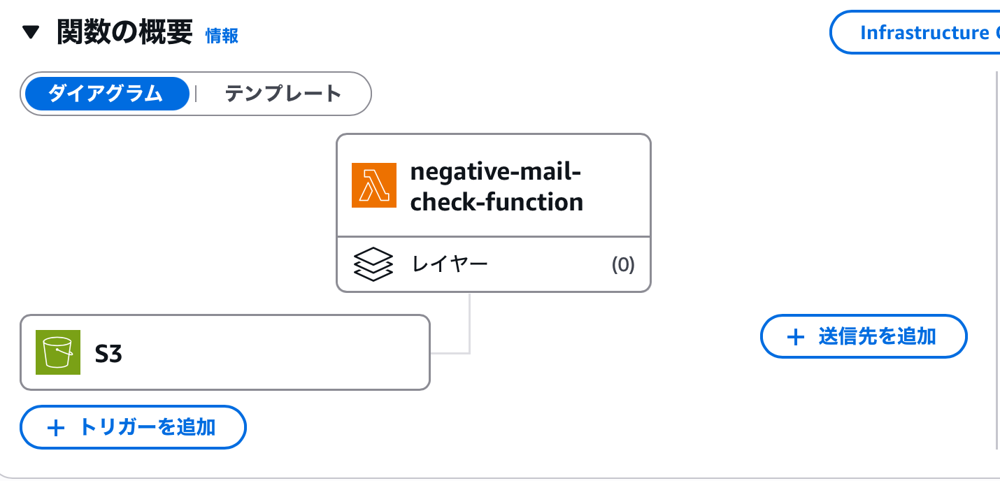

## 実行ロールへS3・Comprehendアクセス権限を追加しました。
LambdaがS3からファイルを取得し、AmazonComprehendで感情分析を行えるようIAMロールへ権限を追加しました。
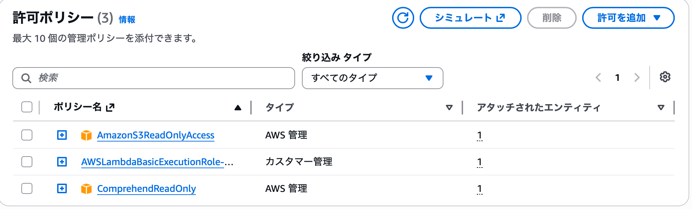

## S3イベント通知を設定しました。
S3へテキストファイルがアップロードされた際、自動でLambdaが起動するようイベント通知を設定しました。
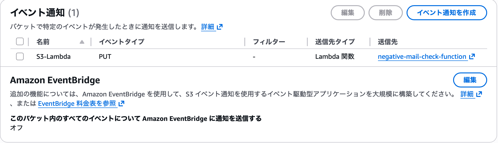

## CloudWatch Logsでネガティブ判定を確認しました。
アップロードしたネガティブテキストがAmazon Comprehendによって「NEGATIVE」と判定されたことを確認しました。
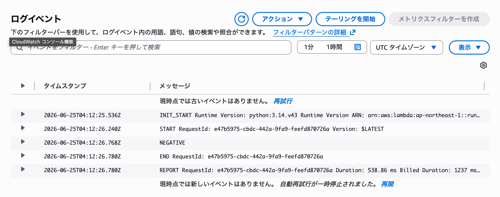

## DynamoDBテーブルを作成しました。
感情分析結果を保存するためのDynamoDBテーブルを作成しました。
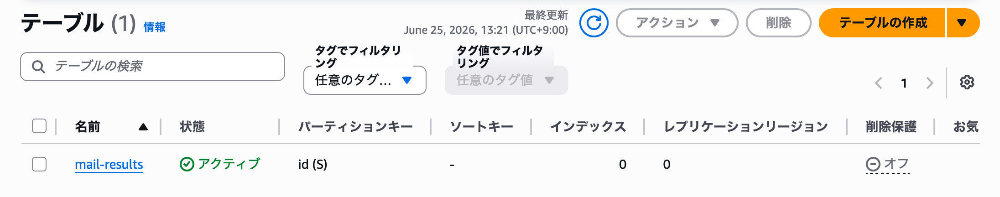

## 実行ロールへDynamoDBアクセス権限を追加しました。
LambdaからDynamoDBへ分析結果を保存できるよう、IAMロールへ権限を追加しました。
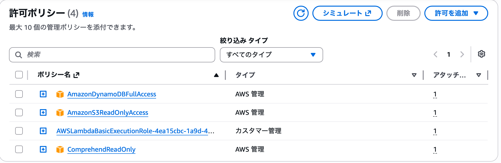

## DynamoDBへネガティブテキストが保存されました。
感情分析結果がDynamoDBへ正常に保存されていることを確認しました。
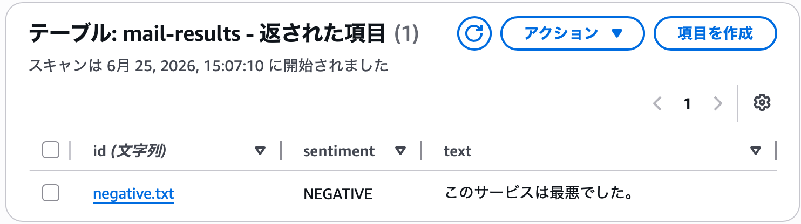

## SNSトピックを作成しました。
ネガティブ検知時にメール通知を送信するため、SNSトピックを作成しました。
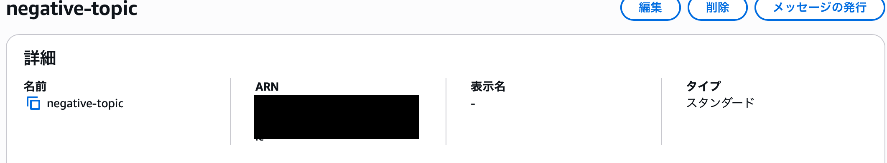

## 実行ロールへSNSアクセス権限を追加しました。
LambdaからSNS通知を送信できるよう、IAMロールへ権限を追加しました。
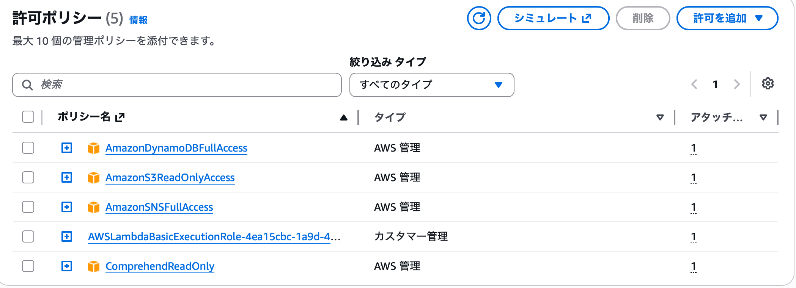

## SNSサブスクリプションを設定しました。
SNSサブスクリプションを設定しました。
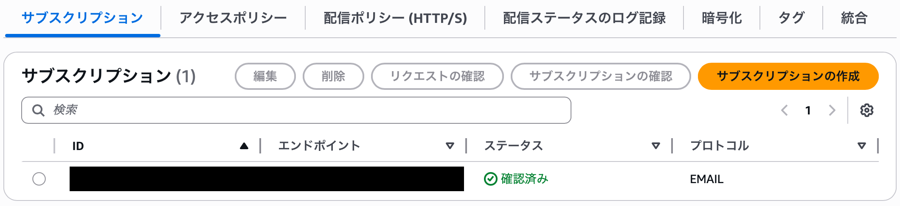

## CloudWatch Logsでネガティブ判定を再確認しました。
SNS連携後も正常にNEGATIVE判定されていることを確認しました。
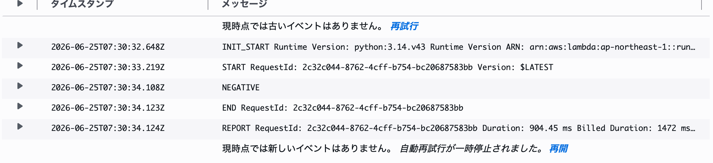

## DynamoDBへの保存を再確認しました。
ネガティブテキストがDynamoDBへ正常保存されていることを確認しました。
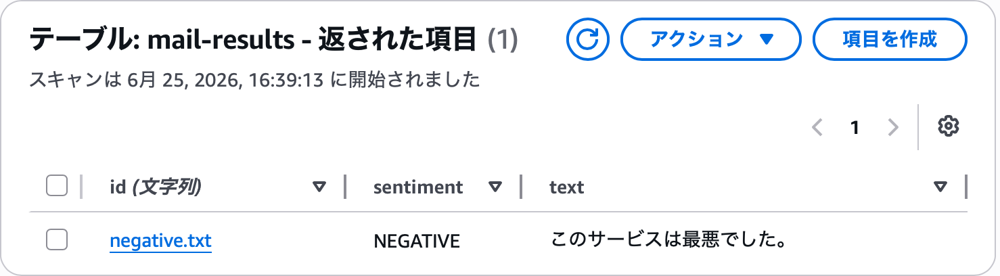

## メール通知を確認しました。
ネガティブ判定時にSNS経由でメール通知が送信されることを確認しました。
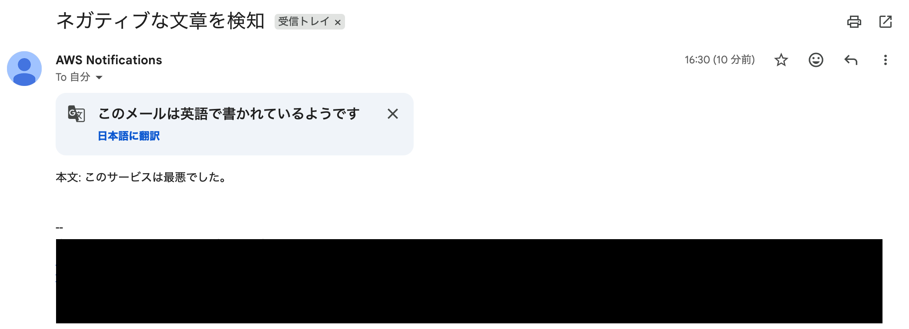

## ポジティブテキストをアップロードしました。
ポジティブ文章をアップロードし、正常に感情分析できるか検証しました。
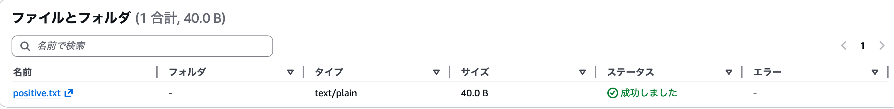

## DynamoDBへポジティブ判定結果が保存されました。
Amazon ComprehendによってPOSITIVE判定された結果がDynamoDBへ保存されました。
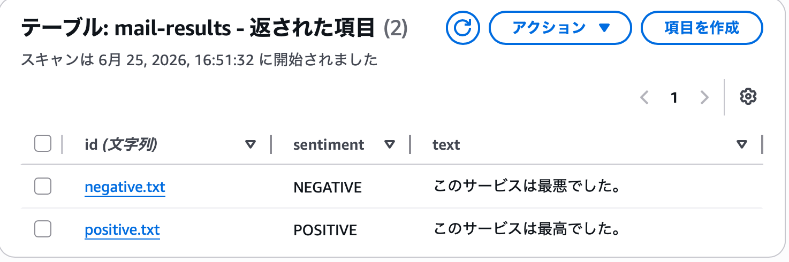

## CloudWatch Logsでポジティブ判定を確認しました。
CloudWatch Logs上で「POSITIVE」と判定されていることを確認しました。
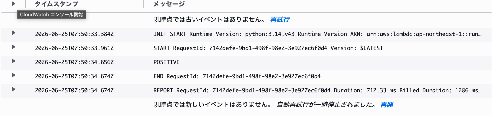
