# システム概要
S3にアップロードされたテキストをAmazon Comprehendで感情分析し、ネガティブ判定時にはSNSでメール通知を行うシステム。分析結果はDynamoDBに保存。

# 作成理由
普段Udemyを用いてAWS資格の学習を行っている中で、
レビュー欄にネガティブなコメントが投稿されるケースが多く見られました。
それらのネガティブレビューに対して出品者が個別に対応している様子を確認し、
対応が必要なコメントかどうかを判断するシステムを作成したいと考えました。

# 使用サービス
- Amazon S3
- AWS Lambda
- Amazon Comprehends
- Amazon DynamoDB
- Amazon SNS
- Amazon CloudWatch
- AWS IAM

# サービス選定理由
サービス：選定理由 
Amazon S3：ユーザーがアップロードしたテキストファイルを保存するため 
AWS Lambda：S3イベント通知を受け、自動で感情分析を実行するため 
Amazon Comprehend：AIによる感情分析を実施するため 
Amazon DynamoDB：感情分析結果を保存するため 
Amazon SNS：ネガティブ判定時にメール通知を送信するため 
Amazon CloudWatch Logs：Lambdaの実行結果やエラー内容を確認するため 
AWS IAM：各AWSサービスへのアクセス権限を管理するため

# 構成図
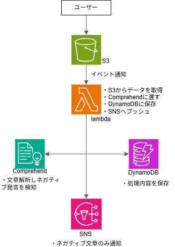

# システム処理フロー
1.ユーザーがS3へテキストファイルをアップロード 
2.S3イベント通知によりLambdaが起動 
3.LambdaがS3からファイル内容を取得 
4.Amazon Comprehendで感情分析を実施 
5.分析結果をDynamoDBへ保存 
6.negative判定時の場合、SNSでメール通知を送信

# 障害時の運用
本システムではCloudWatch Logsに処理結果を出力しており、
エラー発生時はログを確認することで原因調査が可能です。

# スクリーンショット
## S3バケットを作成しました
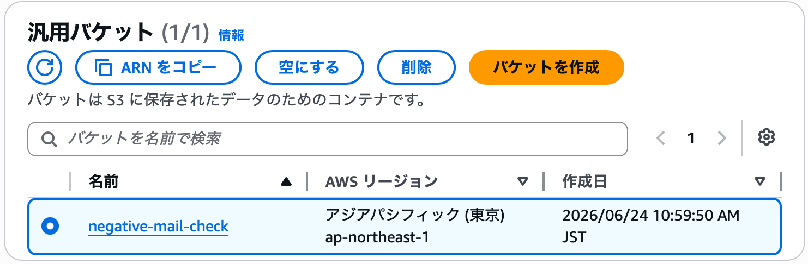

## Lambdaを作成しました。
S3イベント通知を受け取り、自動で感情分析を実行するLambdaを作成しました。コードは別ファイルに記載しています。
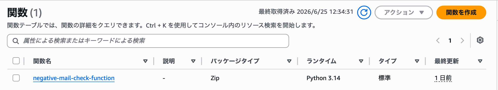

## Lambdaダイアグラムを確認しました。
S3からLambdaへイベント通知が行われる構成になっていることを確認しました
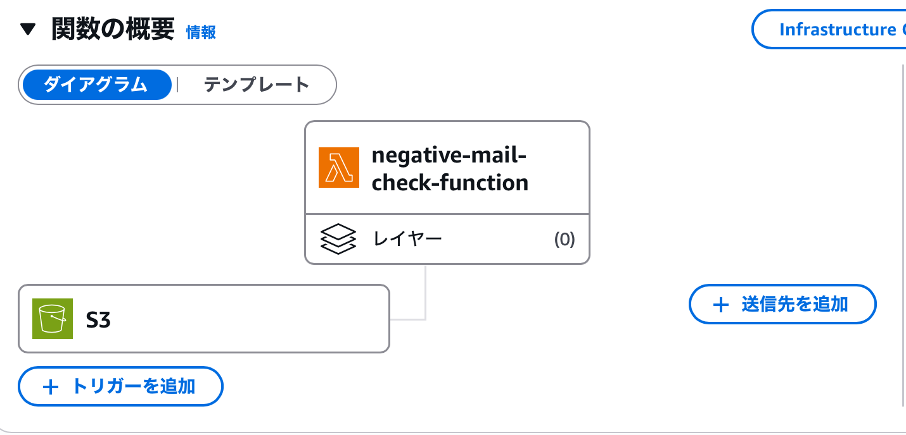

## 実行ロールへS3・Comprehendアクセス権限を追加しました。
LambdaがS3からファイルを取得し、AmazonComprehendで感情分析を行えるようIAMロールへ権限を追加しました。
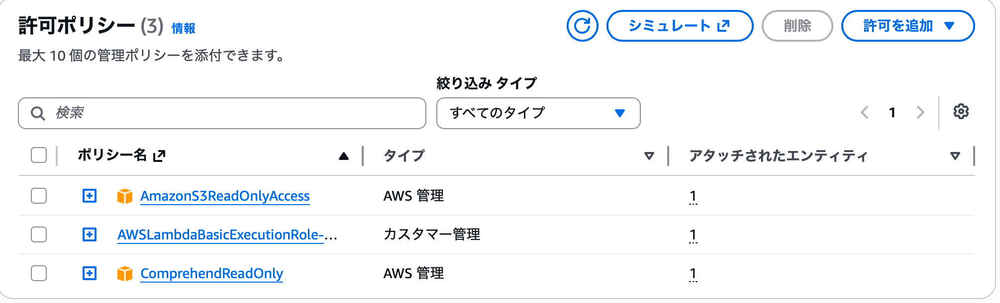

## S3イベント通知を設定しました。
S3へテキストファイルがアップロードされた際、自動でLambdaが起動するようイベント通知を設定しました。
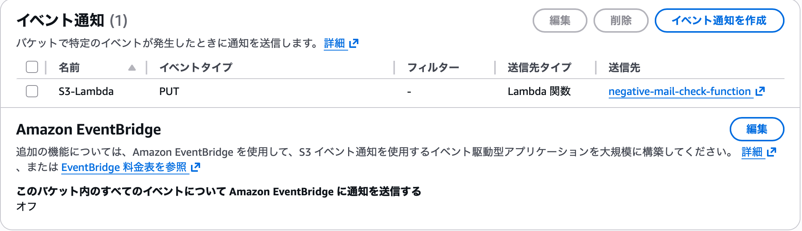

## CloudWatch Logsでネガティブ判定を確認しました。
アップロードしたネガティブテキストがAmazon Comprehendによって「NEGATIVE」と判定されたことを確認しました。
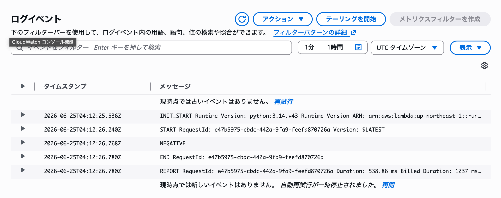

## DynamoDBテーブルを作成しました。
感情分析結果を保存するためのDynamoDBテーブルを作成しました。
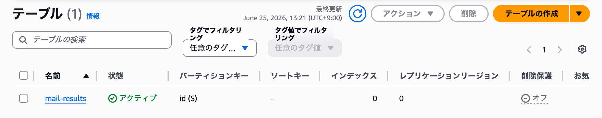

## 実行ロールへDynamoDBアクセス権限を追加しました。
LambdaからDynamoDBへ分析結果を保存できるよう、IAMロールへ権限を追加しました。
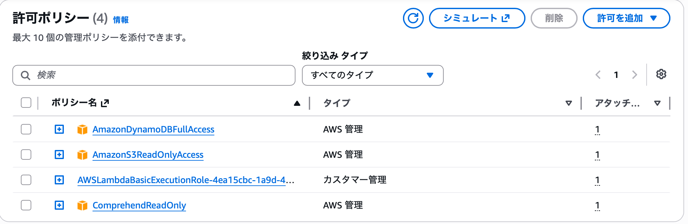

## DynamoDBへネガティブテキストが保存されました。
感情分析結果がDynamoDBへ正常に保存されていることを確認しました。
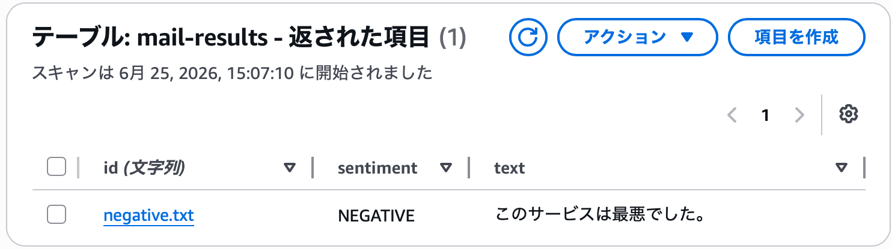

## SNSトピックを作成しました。
ネガティブ検知時にメール通知を送信するため、SNSトピックを作成しました。
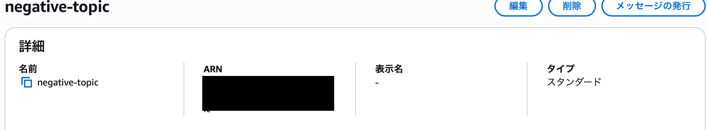

## 実行ロールへSNSアクセス権限を追加しました。
LambdaからSNS通知を送信できるよう、IAMロールへ権限を追加しました。
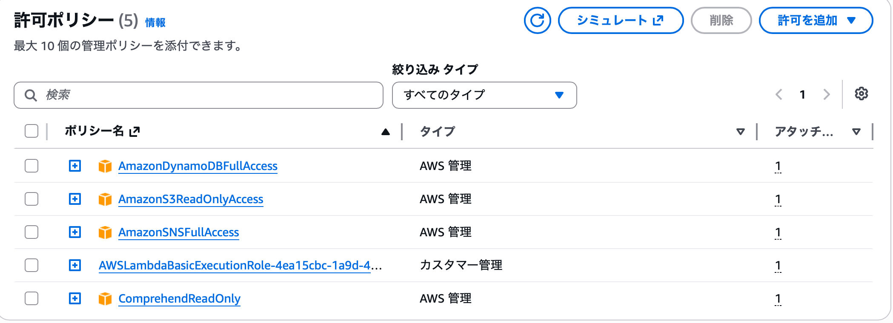

## SNSサブスクリプションを設定しました。
SNSサブスクリプションを設定しました。
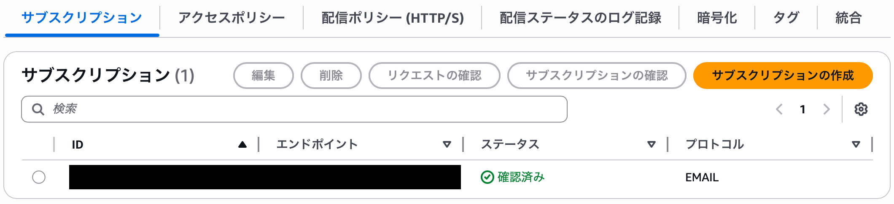

## CloudWatch Logsでネガティブ判定を再確認しました。
SNS連携後も正常にNEGATIVE判定されていることを確認しました。
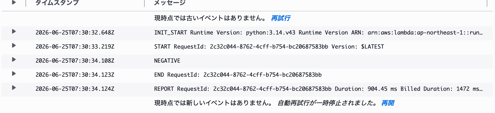

## DynamoDBへの保存を再確認しました。
ネガティブテキストがDynamoDBへ正常保存されていることを確認しました。
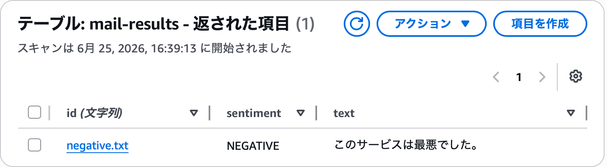

## メール通知を確認しました。
ネガティブ判定時にSNS経由でメール通知が送信されることを確認しました。
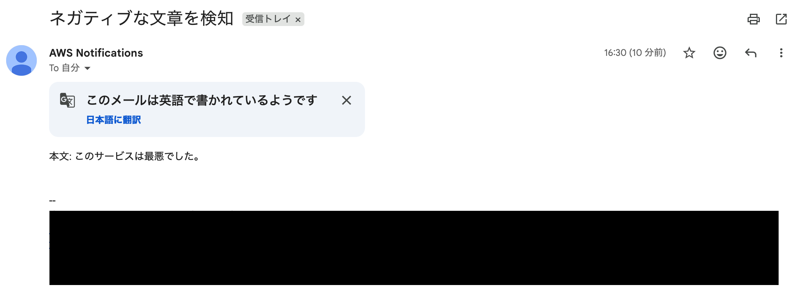

## ポジティブテキストをアップロードしました。
ポジティブ文章をアップロードし、正常に感情分析できるか検証しました。
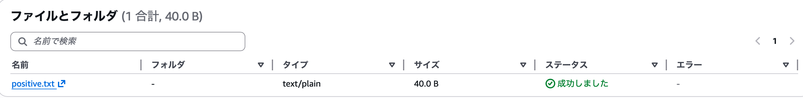

## DynamoDBへポジティブ判定結果が保存されました。
Amazon ComprehendによってPOSITIVE判定された結果がDynamoDBへ保存されました。
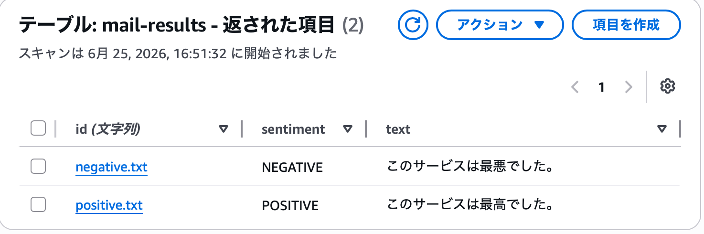

## CloudWatch Logsでポジティブ判定を確認しました。
CloudWatch Logs上で「POSITIVE」と判定されていることを確認しました。
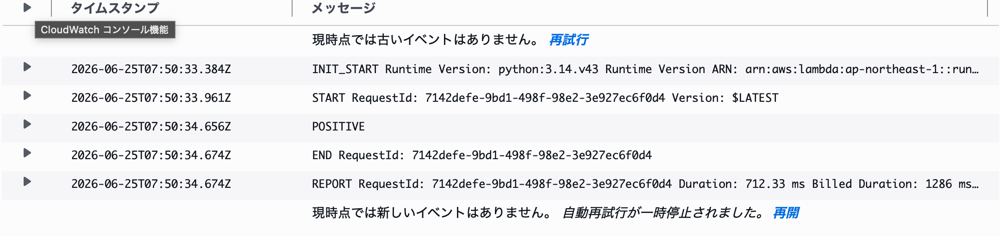

# 本システムの前提・制約
- 入力データはUTF-8形式のテキストファイルを対象としています。
- Amazon Comprehendの日本語感情分析機能を利用しています。
- メール通知はNEGATIVE判定時のみ送信します。
- DynamoDBには分析結果を保存し、履歴を管理しています。
- 学習・検証を目的としたシステムであり、単一のLambda関数で構成しています。

# 工夫した点
- S3イベント通知を利用し、イベント駆動型の構成を採用しました。
- Lambdaを利用することでサーバレス構成としました。
- Amazon Comprehendを利用し、AIによる感情分析をしました。
- DynamoDBへ分析結果を保存することで、分析履歴を保持できるようにしました。
- SNSを利用してネガティブ検知時のみメール通知を送信する構成にしました。
- 学習用途のため、検証後は即座に不要リソースを削除しAWSコストを抑える運用をしました。

# 苦労した点
## S3からLambda実行時のファイル取得エラー
S3へアップロードした日本語ファイルで `NoSuchKey` エラーが発生しました。 
原因調査を行った結果、ファイル形式や文字コードの影響を受けていることを確認し、UTF-8形式のテキストファイルを使用することで解決しました。 

## Lambdaのインデントエラー
LambdaへDynamoDB処理を追加した際、Pythonのインデントエラーが発生しました。
CloudWatch Logsを確認しながら、Pythonのインデント構造を修正して対応しました。

# セキュリティ上の考慮
検証環境ではAWS管理ポリシーを利用しました。 
本番環境では、S3・Comprehend・DynamoDB・SNSのみへアクセス可能なカスタムIAMポリシーを作成し、最小権限の原則を適用することを想定しています。

# コスト面の考慮
- サーバーレスサービスを利用し、常時稼働するサーバーを構築していません。
- 検証終了後はS3・Lambda・DynamoDB・SNS・CloudWatch Logsなど不要なリソースを削除しました。
- Amazon Comprehendは分析実行時のみ課金されるため、必要なタイミングのみ利用しています。

# 今後の改善案
API Gatewayを追加しWebアプリ化し、フロント画面を作成したり、terraformによるIaC化を考えています。
