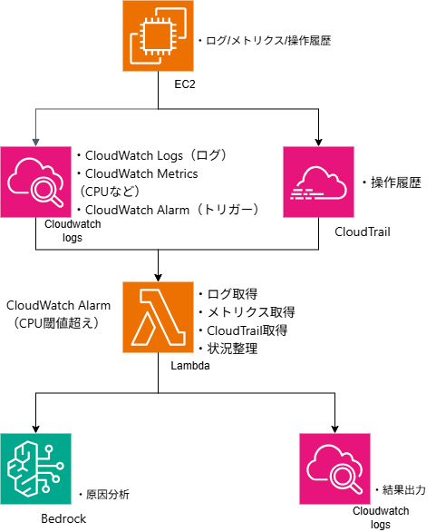

# 概要
CloudWatch Logs、CloudWatch Metrics、CloudTrailから取得した情報を統合し、  Bedrock（Claude）に自然言語として渡すことで、  インフラ障害の原因を自動分析するシステムを構築しました。

# 作成理由
業務の中で、障害が発生した際にはまずログやメトリクスを確認し原因調査を行いますが、 
- 調査する範囲が担当者によって異なる
- 情報のまとめ方が人によってばらつく
といった課題があり、原因特定のスピードや精度に差が出ると感じました。 
また、アプリケーションチームが利用しているサーバーで障害が発生した場合、
インフラチームによる調査を待つ必要があり、 　
- 調査開始までに時間がかかる可能性がある
- 初動対応が遅れるリスクがある
という運用上の課題もあると考えました。 
これらの背景から、ログ・メトリクス・操作履歴を統合し、AIによって原因分析を自動化することで、 
「調査の属人化解消」と「初動対応の迅速化」を目的として本システムを構築しました。

