# 概要
CloudWatch AlarmをトリガーとしてLambdaを自動実行し、CloudWatch Logs・CloudWatch Metrics・CloudTrailから取得した情報を統合してAmazon Bedrock（Claude）へ送信することで、インフラの状態や障害の原因をAIが自動分析するシステムを構築しました。 
ログ・メトリクス・操作履歴を横断的に分析し、障害発生時の初動対応を支援することを目的としています。

# 作成理由
業務の中で、障害が発生した際にはまずログやメトリクスを確認し原因調査を行いますが、 
- 調査する範囲が担当者によって異なる
- 情報のまとめ方が人によってばらつく 
といった課題があり、原因特定のスピードや精度に差が出ると感じました。 
また、アプリケーションチームが利用しているサーバーで障害が発生した場合、
インフラチームによる調査を待つ必要があり、　
- 調査開始までに時間がかかる可能性がある
- 初動対応が遅れるリスクがある 
という運用上の課題もあると考えました。 
これらの背景から、ログ・メトリクス・操作履歴を統合し、AIによって原因分析を自動化することで、 
「調査の属人化解消」と「初動対応の迅速化」を目的として本システムを構築しました。

# 使用サービス
- Amazon EC2
- Amazon CloudWatch Logs
- Amazon CloudWatch Metrics
- Amazon CloudWatch Alarm
- AWS CloudTrail
- AWS Lambda
- Amazon Bedrock（Claude）

# サービス選定理由
サービス：選定理由
Amazon EC2：監視対象となるWebサーバーを再現するため
CloudWatch Logs：nginxのアクセスログ・エラーログを一元管理するため
CloudWatch Metrics：CPU使用率を監視し、高負荷状態を検知するため
CloudWatch Alarm：閾値超過を契機にLambdaを自動実行するため
AWS Lambda：サーバー管理不要で、イベント発生時のみ処理を実行できるため
AWS CloudTrail：障害原因となり得る設定変更や操作履歴を確認するため
Amazon Bedrock：AWS内で生成AIを利用し、監視情報を自然言語で分析するため

# 構成図
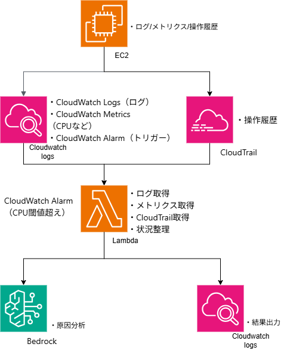

# 処理フロー

1. EC2でアプリケーションが動作 
2. CloudWatch Logsにログが蓄積される 
3. CloudWatch MetricsでCPUなどのメトリクスを取得 
4. CloudWatch Alarmが閾値超過を検知 
5. Lambdaが自動起動 
6. Lambdaが以下の情報を取得 
   - ログ（CloudWatch Logs）
   - CPU使用率（CloudWatch Metrics）
   - 操作履歴（CloudTrail） 
7. Lambda内でデータを整形 
8. AIに渡すため自然言語へ変換 
9. Bedrock（Claude）で原因分析 
10. 分析結果をCloudWatch Logsに出力

# スクリーンショット
## 監視対象となるEC2インスタンスを作成しました。
AIによる監視・分析の対象となるWebサーバーを構築するため、Amazon EC2インスタンスを作成しました。
本システムでは、このEC2で生成されるログやCPU使用率などのメトリクスをCloudWatchへ収集し、AI分析に利用します。
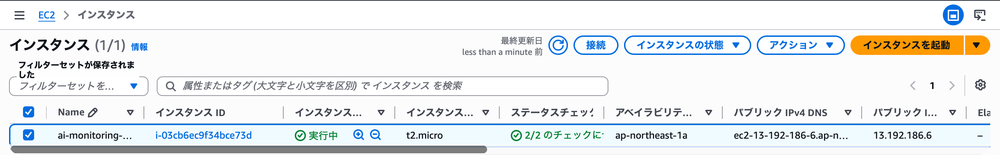

## EC2にSSH接続をしました。
EC2インスタンスへSSH接続を行い、WebサーバーやCloudWatch Agentの構築・設定を実施するための作業環境を準備しました。
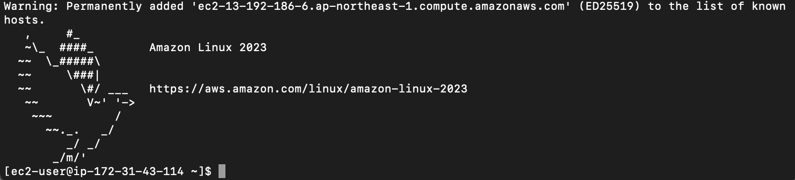

## nginxをインストールし、監視対象となるWebサーバーを構築しました。
Webサーバーとしてnginxをインストールしました。生成されるアクセスログ・エラーログをCloudWatch Logsへ送信し、AI分析の入力データとして利用します。
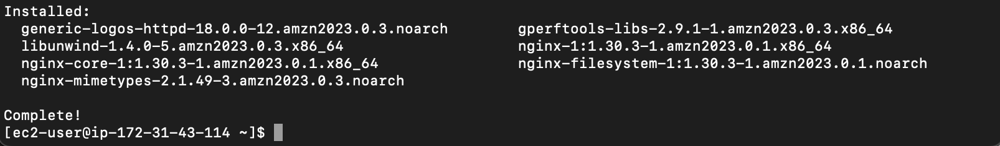

## EC2上にnginxを構築し、Webサーバーが正常に動作していることをブラウザから確認しました。
ブラウザからEC2上のnginxへアクセスし、Webサーバーが正常に稼働していることを確認しました。この正常な状態を基準として、後続の異常検知テストを実施します。

## CloudWatch Agentをインストールし、EC2のログをCloudWatch Logsへ送信する準備を行いました。
CloudWatch Agentをインストールし、EC2で生成されるログやメトリクスをAWSへ送信するための準備を行いました。
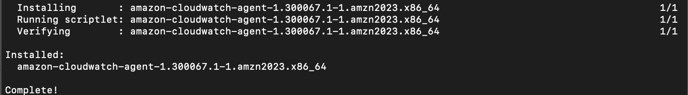

## EC2へCloudWatch Agentを導入し、CloudWatch LogsおよびCloudWatch Metricsの収集をしました。
CloudWatch Agentを設定し、nginxのログとEC2のCPU使用率などのメトリクスをCloudWatchへ収集できるよう構成しました。
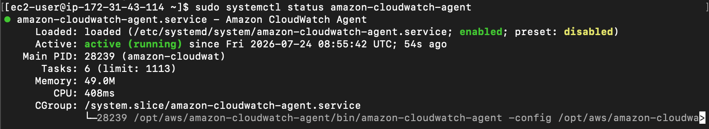

## CloudWatch LogsへEC2のnginxアクセスログ・エラーログを送信し、ログ収集基盤を構築しました。
CloudWatch Logsへnginxのアクセスログ・エラーログを送信し、サーバー上のログをAWS上で一元管理できるログ収集基盤を構築しました。
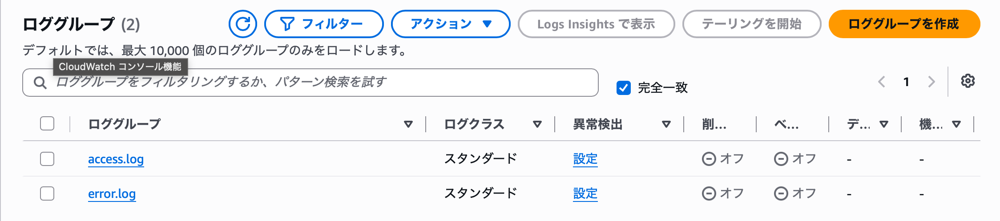

## EC2上で稼働するnginxのアクセスログをCloudWatch Logsへ送信し、AWS上で一元管理できるようにしました。
CloudWatch Logs上でアクセスログが正常に収集されていることを確認しました。Lambdaはこのログを取得し、AI分析に利用します。
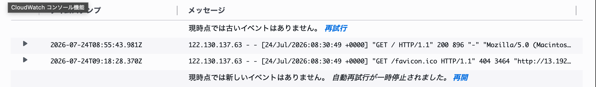

## CloudWatch Alarmから起動されるLambda関数で、CloudWatch Logs・CloudWatch Metrics・CloudTrailを取得し、Bedrockへ分析を依頼します。
CloudWatch Alarmをトリガーとして起動するLambda関数を作成しました。CloudWatch Logs・CloudWatch Metrics・CloudTrailの情報を収集・統合し、Amazon Bedrockへ分析を依頼します。
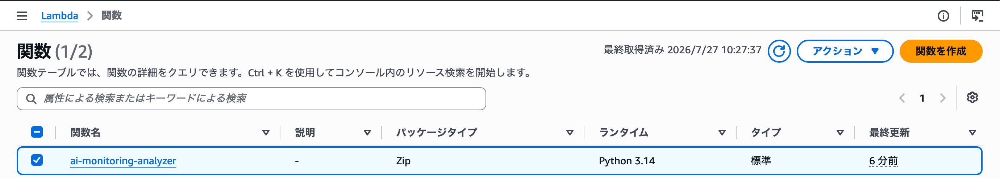

## Lmabdaに許可ポリシーをアタッチしました。
LambdaがCloudWatch Logs・CloudWatch Metrics・CloudTrail・Amazon Bedrockへアクセスできるよう、必要なIAMポリシーをアタッチしました。
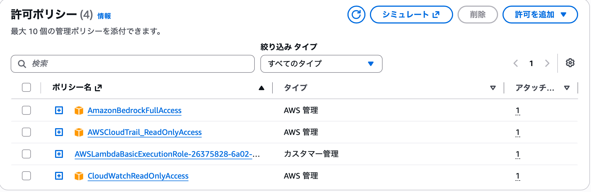

## LambdaがCloudWatch Logs・CloudWatch Metrics・CloudTrailの情報を取得し、Amazon Bedrock（Claude Sonnet 4.5）へ送信しました。AIが収集したデータを分析し、システムの状態・想定される原因・推奨対応を日本語で自動生成していることを確認しました。
LambdaがCloudWatch Logs・CloudWatch Metrics・CloudTrailから収集した情報をAmazon Bedrock（Claude Sonnet 4.5）へ送信し、AIによる障害分析を実行しました。システムの状態・想定される原因・推奨対応が日本語で自動生成されることを確認しました。
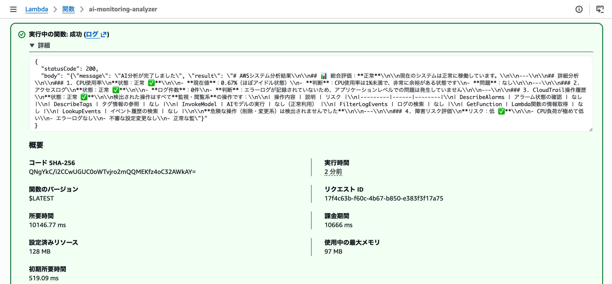
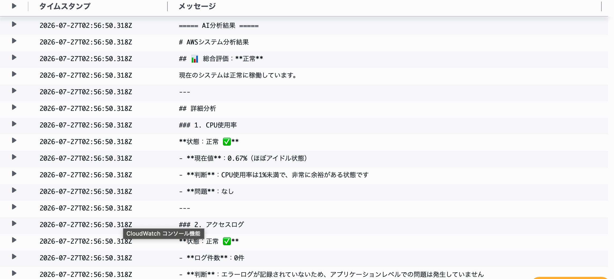
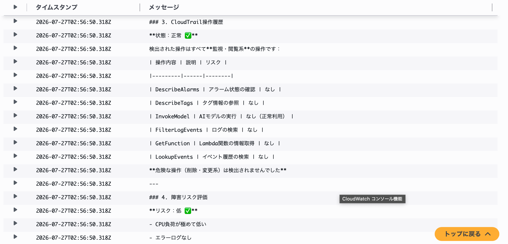

## EC2へCPU負荷をかけ、CloudWatch Alarmが高負荷を正常に検知することを確認しました。
EC2へCPU負荷を発生させ、CPU使用率が70%を超えた際にCloudWatch Alarmが正常にALARM状態へ遷移することを確認しました。本システムでは、このアラームをトリガーとしてLambda関数を自動実行し、AIによる障害分析を開始します。
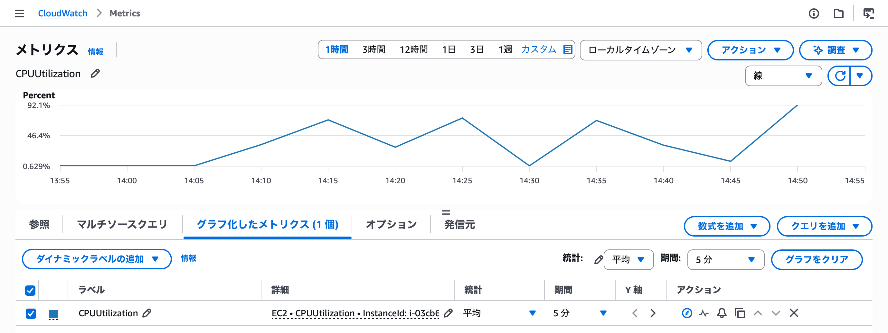
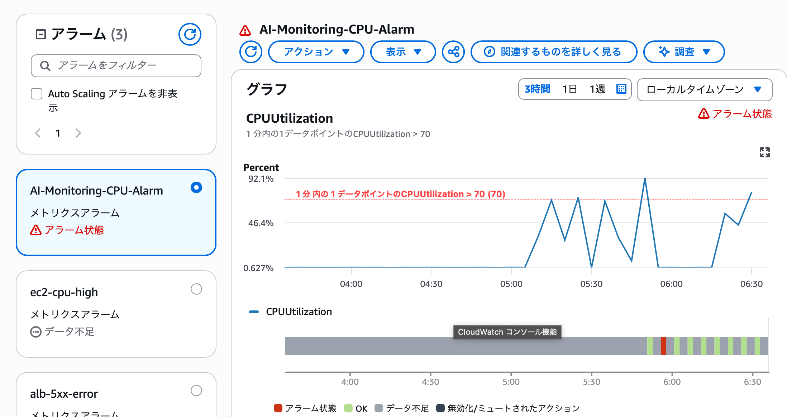

## CPU高負荷を検知し、AIによる自動分析が実行されることを確認しました。
EC2へCPU負荷を与え、CloudWatch AlarmがCPU使用率の閾値超過を検知したことを契機に、Lambda関数が自動実行されました。 
LambdaはCloudWatch Metrics・CloudWatch Logs・CloudTrailから情報を取得してAmazon Bedrock（Claude Sonnet 4.5）へ送信し、CPU使用率が44%から78%へ急上昇していること、アプリケーションの応答速度低下やサービス影響の可能性があることを日本語で自動分析しました。
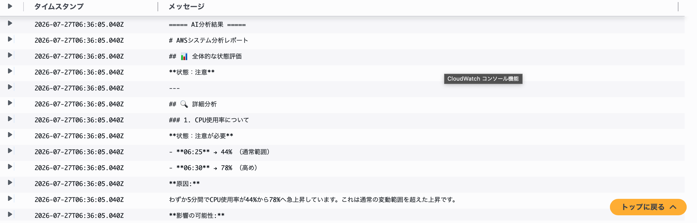
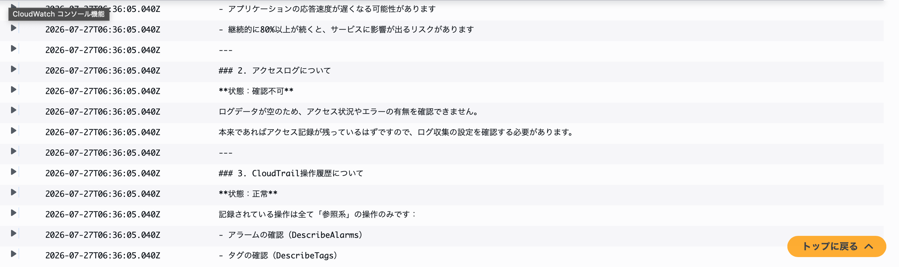
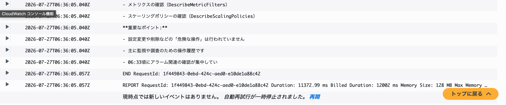

# 本システムの前提・制約
- 現在は単一のEC2インスタンスを監視対象としています。
- 異常検知条件はCPU使用率70%以上としています。
- CloudWatch Logsから取得するログは最新5件に限定しています。
- Amazon Bedrockの分析結果は初動調査を支援するものであり、最終判断は運用担当者が行う想定です。
- 本システムは原因分析までを対象とし、自動復旧や通知機能は未実装です。

# 工夫した点
- CloudWatch Logs・CloudWatch Metrics・CloudTrailの3種類の情報を統合してAIへ渡すことで、ログだけでは判断できないシステム全体の状況を分析できるようにしました。
- CloudWatch AlarmをトリガーとしてLambdaを自動実行する構成とし、異常検知からAI分析開始までを自動化しました。
- AIへデータをそのまま渡すのではなく、ログ・メトリクス・操作履歴を自然言語に整形してからAmazon Bedrockへ送信することで、分析結果が分かりやすくなるよう工夫しました。
- 正常時の動作確認だけでなく、EC2へCPU負荷を発生させる異常系テストを実施し、CloudWatch Alarm・Lambda・Amazon Bedrockが連携して動作することを確認しました。

# 構築時に発生した問題と対応
| 問題 | 原因 | 対応 |
| CloudWatch LogsでSignature expiredが発生 | PCの時刻ずれ | OSの日時設定を修正 |
| Claude Sonnet 5を呼び出せない | AWSアカウントで利用不可 | 利用可能なClaude Sonnet 4.5へ変更 |
| Bedrock呼び出しでMalformed input request | 文字列で組み立てたJSONが不正 | Python辞書を`json.dumps()`で変換 |
| Lambdaが3秒で終了 | デフォルトタイムアウトが短い | タイムアウトを30秒へ変更 |
| AlarmからLambdaを起動できない | Lambdaのリソースベースポリシー不足 | `lambda:InvokeFunction`権限を追加 |

# セキュリティ上の考慮
検証を優先し、構築時はAWS管理ポリシーを使用しました。 
本番運用を想定する場合は、Lambdaが参照するロググループ、EC2メトリクス、CloudTrailイベント、Bedrockモデルに対象を限定したカスタムIAMポリシーへ変更し、最小権限の原則を適用します。

# コスト面の考慮
- EC2は検証時のみ起動し、未使用時は停止しています。
- Lambdaはイベント駆動とし、常時稼働するサーバーを追加していません。
- CloudWatch Logsの保持期間は30日に設定しています。
- Bedrockは推論実行時のみ課金されるため、必要なタイミングに限定して呼び出します。

# 今後の改善
- CPU使用率だけでなく、メモリ使用率・ディスク使用率・ネットワーク使用率など複数の監視項目へ対応する。
- Amazon SNSやSlackと連携し、AI分析結果を運用担当者へ自動通知できるようにする。
- Amazon DynamoDBへ分析履歴を保存し、過去の障害内容や分析結果を参照できるようにする。
- 複数のEC2インスタンスを監視対象とし、大規模なシステムでも利用できるよう拡張する。
