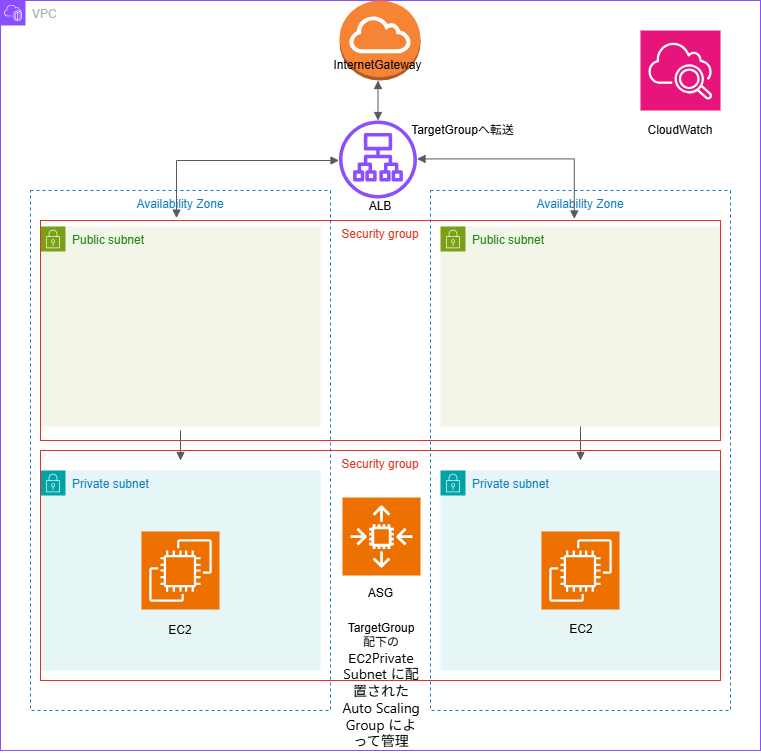

# Terraform AWS 基本構成

AWS の基本的なネットワーク構成（VPC / Subnet）を
Terraform で理解・実装するための学習用リポジトリです。

## 現在の構成
- VPC
- Public / Private / DB Subnet
- 2AZ 構成
- Internet Gateway
- Public Route Table
- Application Load Balancer
- Target Group

## 設計方針
- 理解を優先し、リソースは明示的に定義
- 後続で count / locals によるリファクタを予定
- drow.ioにて既に構成図作成済み

## 今後の予定
- apply時のマネジメントコンソール上のスクリーンショット随時添付

## 障害対応シナリオ
運用・障害対応シナリオについては  にまとめています。

### 初期版ver1.0

### 修正版ver1.1

