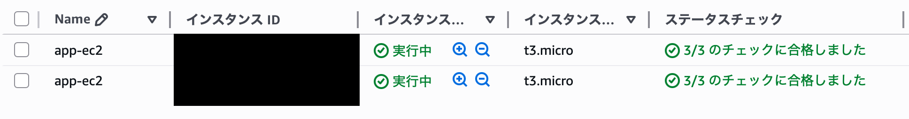

## 障害概要
Security Groupの誤設定により、ALB経由でWebアクセスができなくなった。

## 発生方法
EC2のSecurity Groupから、ALB Security Groupを送信元とした
80番ポートのインバウンドルールを削除した。

## 発生時の現象
- ALB DNS名にアクセスするとWebが表示されない
- Target GroupのTargetsがUnhealthyとなる

## 確認したこと
- ALBはActive
- Listener設定は正常
- EC2はRunning
- EC2 Security GroupにALBからの通信許可がない

## 原因
EC2のSecurity Groupにおいて、ALBからのHTTP通信のインバウンドルールが許可されていなかった。(削除されていた)

## 対応
EC2 Security GroupにALB Security Groupをsourceとした
HTTP(80)のインバウンドルールを追加した。

## 再発防止
- IPアドレスではなくSecurity Groupをsourceに指定する
- Target GroupのHealth Checkを必ず確認する

## 補足
本シナリオでは
Private Subnet上のEC2をWebサーバとして利用するにあたり、
Webサービス（httpd）のインストールのため、一時的に外向き通信が必要となった。
それに伴い一時的にNATを作成したが、コスト発生のため障害対応後に削除、ElasticIPも解放した。

## スクリーンショット
### webアクセス通常時（障害前）

### ターゲットグループhealthy（障害前）

### EC2の状態（障害前）

### セキュリティグループ（障害前）

### webにアクセスできない

ALBのDNS名にアクセスしたが、Webページが表示されなかった

### ALBはアクティブ

ALB自体はアクティブだった

### ターゲットグループunhealthy

ALBのTarget Groupを確認したところ、全てのターゲットが Unhealthy となっていた

### EC2はアクティブ

EC2自体には問題はなかった

### EC2セキュリティグループ

EC2のセキュリティグループを見るとALBからのインバウンドルールがなかった

### インバウンドルール追加

EC2のセキュリティグループのインバウンドルールにALBからのインバウンドを追加

### webアクセス成功

セキュリティグループを修正後、webアクセス成功を確認
