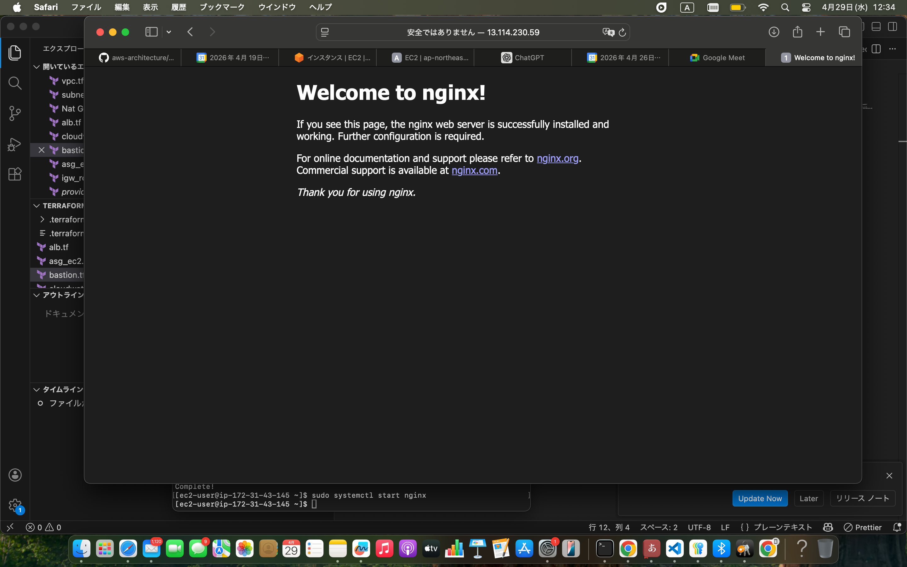
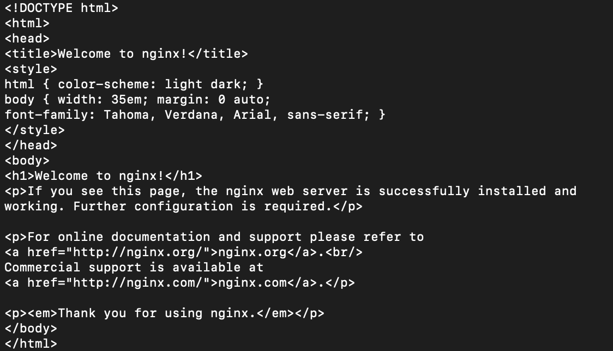
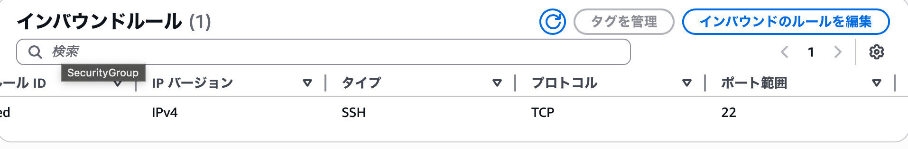
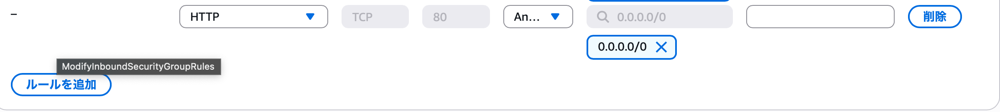
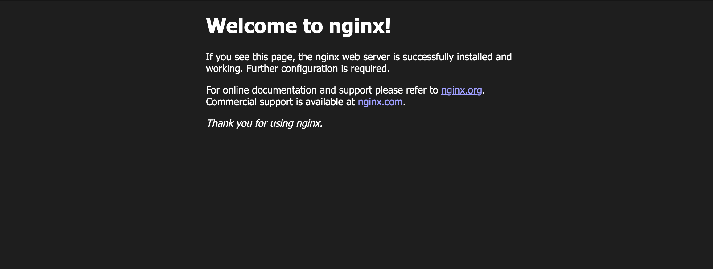

## 障害概要
EC2上でWebサービス（nginx）は起動しているが、Security Groupの誤設定によりHTTPアクセスができなくなった。

## 発生方法
EC2にnginxをインストールし、HTTP(80)でWebアクセスできることを確認後、
EC2のSecurity GroupからHTTP(80)のインバウンドルールを削除した。

## 発生時の現象
- EC2のパブリックIPまたはDNS名へHTTPアクセスするとタイムアウトする
- ブラウザにWebページが表示されない

## 確認したこと
- EC2はRunning状態
  → インスタンス停止が原因ではないことを確認
- SSHでEC2にログイン可能
  → ネットワーク全断ではないことを確認
- nginxサービスが起動している
  → アプリケーション自体は正常に動作していることを確認
- EC2のSecurity GroupにHTTP(80)のインバウンドルールが存在しない
  → 外部からのHTTP通信が遮断されていると判断

## 原因
EC2のSecurity Groupにおいて、HTTP(80)のインバウンドルールが削除されていたため、
Webサービスは起動しているが外部からアクセスできなかった。

## 対応
EC2のSecurity GroupにHTTP(80)を許可するインバウンドルールを追加した。

## 再発防止
- サービスが起動している場合でも、Security Groupのインバウンドルールを確認する
- 「アクセス不可＝サービス停止」と決めつけず、OS／ミドルウェア／ネットワークの順で切り分けを行う

## スクリーンショット
### webアクセス通常時（障害前）

### インバウンドルール確認（障害前）

### nginxサーバータイムアウト

### nginxは正常

### セキュリティグループで80を閉じている

### インバウンドルールを追加

### アクセス成功

